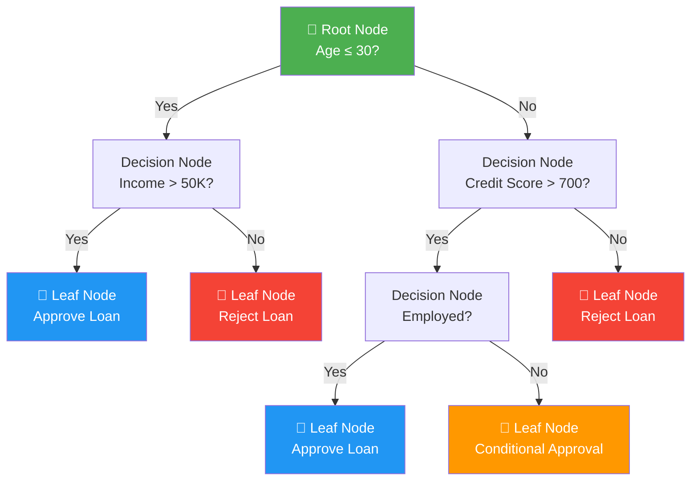

# 🌳 Decision Trees — Complete Study Guide

> **A comprehensive, placement-ready reference for Decision Trees in Machine Learning**  
> Covers theory, mathematics, algorithms, implementation, and interview preparation.

---

## 📋 Table of Contents

1. [Introduction](#1-introduction)
2. [Structure of a Decision Tree](#2-structure-of-a-decision-tree)
3. [How Decision Trees Work](#3-how-decision-trees-work)
4. [Mathematical Foundations](#4-mathematical-foundations)
5. [Decision Tree Algorithms](#5-decision-tree-algorithms)
6. [Classification Trees](#6-classification-trees)
7. [Regression Trees](#7-regression-trees)
8. [Overfitting and Underfitting](#8-overfitting-and-underfitting)
9. [Pruning Techniques](#9-pruning-techniques)
10. [Hyperparameters](#10-hyperparameters)
11. [Advantages](#11-advantages)
12. [Disadvantages](#12-disadvantages)
13. [Best Practices](#13-best-practices)
14. [Comparison with Other Algorithms](#14-comparison-with-other-algorithms)
15. [Interview Questions & Answers](#15-interview-questions--answers)
16. [Summary and Conclusion](#16-summary-and-conclusion)

---

## 1. Introduction

### What Are Decision Trees?

A **Decision Tree** is a supervised machine learning algorithm that models decisions and their possible consequences in a tree-like structure. It splits data into subsets based on feature values, recursively, until a stopping criterion is met. The result is an intuitive, human-readable model that mirrors how humans make decisions.

Think of it like a flowchart: you start at the top (root), answer a series of yes/no or threshold-based questions at each node, and eventually arrive at a prediction at the bottom (leaf).

```
"Should I carry an umbrella today?"
        ↓
   Is it cloudy?
   /          \
 Yes           No
  ↓             ↓
Is humidity   Stay home
> 70%?        without one
  /    \
Yes     No
 ↓       ↓
Take   Maybe
umbrella  take it
```

### Why Decision Trees Are Important

Decision Trees are a cornerstone of machine learning for several reasons:

- **Interpretability:** Unlike black-box models, a decision tree can be visualized and explained to non-technical stakeholders.
- **Foundation for ensembles:** Random Forests, Gradient Boosting, and XGBoost are all built on decision trees.
- **Versatility:** They handle both classification and regression tasks without requiring major architectural changes.
- **Minimal preprocessing:** They do not require feature scaling or normalization.
- **Non-linearity:** They naturally model non-linear decision boundaries.

### Real-World Applications

| Domain | Application |
|--------|-------------|
| **Healthcare** | Disease diagnosis, treatment recommendation |
| **Finance** | Credit risk scoring, fraud detection, loan approval |
| **E-commerce** | Customer segmentation, recommendation systems |
| **Manufacturing** | Fault diagnosis, quality control |
| **HR / Recruitment** | Candidate shortlisting, attrition prediction |
| **Marketing** | Campaign targeting, churn prediction |
| **Cybersecurity** | Intrusion detection, spam filtering |

---

## 2. Structure of a Decision Tree

A decision tree consists of four fundamental components:

### Components

| Component | Description |
|-----------|-------------|
| **Root Node** | The topmost node; represents the entire dataset and the first/best split |
| **Decision Node** | An internal node; splits data based on a feature and threshold |
| **Leaf Node** | Terminal node; holds the final prediction (class label or value) |
| **Branch** | A connection between nodes representing the outcome of a test condition |

### Mermaid Diagram



### Depth and Size

- **Depth** = the length of the longest path from root to leaf
- **Shallow trees** = underfitting risk; **Deep trees** = overfitting risk
- Optimal depth is tuned using cross-validation

---

## 3. How Decision Trees Work

### Splitting

At each node, the algorithm evaluates every possible split across all features and thresholds. The **best split** is the one that maximally reduces impurity (or maximizes information gain) in the resulting child nodes.

For a feature with values `[1, 2, 3, 4, 5]`, candidate thresholds are typically the midpoints: `[1.5, 2.5, 3.5, 4.5]`.

### Recursive Partitioning

Decision trees use a **greedy, top-down, recursive partitioning** strategy:

1. Start with the full dataset at the root.
2. Find the best feature and threshold to split on.
3. Divide the data into two (or more) subsets.
4. Recursively apply the same process to each subset.
5. Stop when a stopping criterion is met (max depth, min samples, pure node, etc.).

### Decision-Making Process

```
Input: Dataset D, Features F, Target Y
─────────────────────────────────────────
function BuildTree(D):
    if stopping_criterion(D):
        return LeafNode(majority_class or mean(Y))
    
    best_feature, best_threshold = find_best_split(D, F)
    left_D  = D[feature ≤ threshold]
    right_D = D[feature >  threshold]
    
    return Node(
        split  = (best_feature, best_threshold),
        left   = BuildTree(left_D),
        right  = BuildTree(right_D)
    )
```

**Stopping criteria include:**
- Node is pure (all samples belong to one class)
- Minimum number of samples per node is reached
- Maximum tree depth is reached
- Information gain from the best split is below a threshold

---

## 4. Mathematical Foundations

### 4.1 Entropy

Entropy measures the **impurity or disorder** in a dataset. A node with all samples in one class has entropy = 0 (pure). A node with equal class distribution has maximum entropy.

**Formula:**

$$H(S) = -\sum_{i=1}^{c} p_i \log_2(p_i)$$

Where:
- `S` = dataset
- `c` = number of classes
- `p_i` = proportion of class `i` in `S`

**Example:**

Suppose a dataset has 10 samples: 5 positive, 5 negative.

$$H(S) = -\left(\frac{5}{10}\log_2\frac{5}{10} + \frac{5}{10}\log_2\frac{5}{10}\right) = -(-0.5 - 0.5) = 1.0$$

If all 10 are positive: `H(S) = -(1 × log₂1) = 0` → perfectly pure.

**Key Insight:** Entropy ranges from 0 (pure) to log₂(c) (maximally impure).

---

### 4.2 Information Gain

Information Gain (IG) quantifies the **reduction in entropy** after splitting on a feature.

**Formula:**

$$IG(S, A) = H(S) - \sum_{v \in Values(A)} \frac{|S_v|}{|S|} \cdot H(S_v)$$

Where:
- `A` = feature being evaluated
- `S_v` = subset of `S` where feature `A` has value `v`

**Example:**

Before split: `H(S) = 1.0` (5 pos, 5 neg, 10 total)

After splitting on "Outlook":
- Sunny (4 samples, 2+/2-): H = 1.0
- Overcast (3 samples, 3+/0-): H = 0.0
- Rainy (3 samples, 0+/3-): H = 0.0

$$IG = 1.0 - \left(\frac{4}{10}(1.0) + \frac{3}{10}(0.0) + \frac{3}{10}(0.0)\right) = 1.0 - 0.4 = 0.6$$

**ID3 uses Information Gain to select the best feature.**

---

### 4.3 Gini Index

Gini Index measures the **probability of misclassification** when a random sample is classified according to the class distribution in the node.

**Formula:**

$$Gini(S) = 1 - \sum_{i=1}^{c} p_i^2$$

**Example:**

For 5 positive, 5 negative:

$$Gini = 1 - \left(\left(\frac{5}{10}\right)^2 + \left(\frac{5}{10}\right)^2\right) = 1 - (0.25 + 0.25) = 0.5$$

For a pure node (10 positive):

$$Gini = 1 - (1^2 + 0^2) = 0$$

**Gini Gain (used in CART):**

$$Gini\ Gain = Gini(S) - \sum_{v} \frac{|S_v|}{|S|} \cdot Gini(S_v)$$

**Key Insight:** Gini ranges from 0 (pure) to 1 - 1/c (maximally impure). It is computationally faster than entropy because it avoids logarithm calculations.

---

### 4.4 Gain Ratio

Information Gain tends to **favor features with many distinct values** (e.g., a unique ID column would give maximum IG but is useless for generalization). Gain Ratio corrects this by penalizing high-breadth splits.

**Formula:**

$$GainRatio(S, A) = \frac{IG(S, A)}{SplitInfo(S, A)}$$

$$SplitInfo(S, A) = -\sum_{v \in Values(A)} \frac{|S_v|}{|S|} \log_2 \frac{|S_v|}{|S|}$$

**C4.5 uses Gain Ratio.**

**Example:** If a feature has 10 unique values, `SplitInfo` is high (≈ 3.32), which divides the IG and reduces the apparent quality of the split.

---

### Comparison of Splitting Criteria

| Criterion | Used In | Computation | Bias | Best For |
|-----------|---------|-------------|------|----------|
| Information Gain | ID3 | Moderate (log) | Favors many-valued features | Categorical features |
| Gain Ratio | C4.5 | Moderate | Balanced | Mixed features |
| Gini Index | CART | Fast (no log) | Slight binary bias | Binary splits |

---

## 5. Decision Tree Algorithms

### 5.1 ID3 (Iterative Dichotomiser 3)

**Developed by:** Ross Quinlan (1986)

**Working Principle:**
1. Calculate entropy of the target variable.
2. For each feature, compute Information Gain.
3. Select the feature with the highest IG as the splitting node.
4. Recursively repeat for each branch until a stopping criterion is met.

**Advantages:**
- Simple, intuitive implementation
- Fast training on small datasets
- Handles multi-class problems natively

**Limitations:**
- Only handles categorical features (no continuous support natively)
- Biased toward features with many values
- No pruning mechanism
- Cannot handle missing values

---

### 5.2 C4.5

**Developed by:** Ross Quinlan (1993) — successor to ID3

**Working Principle:**
- Uses Gain Ratio instead of Information Gain
- Handles **continuous features** by finding the optimal binary threshold
- Handles **missing values** by distributing samples probabilistically
- Applies **post-pruning** (error-based pruning)
- Converts the resulting tree into **if-then rules**

**Advantages:**
- Handles both categorical and continuous features
- Corrects ID3's bias toward many-valued attributes
- Built-in pruning mechanism
- More robust to missing data

**Limitations:**
- Slower than ID3 due to Gain Ratio computation
- Memory-intensive for large datasets
- Complex implementation

---

### 5.3 CART (Classification and Regression Trees)

**Developed by:** Breiman et al. (1984)

**Working Principle:**
- Always produces **binary trees** (each node splits into exactly two children)
- For classification: uses **Gini Index** as the splitting criterion
- For regression: uses **Mean Squared Error (MSE)** as the splitting criterion
- Applies **cost-complexity pruning** (also known as weakest link pruning)

**Regression split criterion:**

$$MSE\ Gain = MSE(S) - \frac{|S_L|}{|S|}MSE(S_L) - \frac{|S_R|}{|S|}MSE(S_R)$$

Where leaf predictions are the **mean** of target values in each region.

**Advantages:**
- Handles both classification and regression
- Binary splits are simple and consistent
- Effective pruning strategy
- Basis of Random Forest and Gradient Boosting

**Limitations:**
- Binary splits may need deep trees for multi-class problems
- Greedy splitting can miss globally optimal solutions

---

### Algorithm Comparison Table

| Feature | ID3 | C4.5 | CART |
|---------|-----|------|------|
| **Splitting Criterion** | Information Gain | Gain Ratio | Gini / MSE |
| **Feature Types** | Categorical only | Categorical + Continuous | Categorical + Continuous |
| **Missing Values** | ❌ Not handled | ✅ Handled | ✅ Handled |
| **Pruning** | ❌ None | ✅ Error-based | ✅ Cost-complexity |
| **Tree Structure** | Multi-way | Multi-way | Binary |
| **Task** | Classification | Classification | Classification + Regression |
| **Speed** | Fast | Moderate | Fast |
| **scikit-learn Support** | ❌ | ❌ | ✅ (default) |

> **Note:** scikit-learn's `DecisionTreeClassifier` and `DecisionTreeRegressor` implement **CART**.

---

## 6. Classification Trees

A **Classification Tree** predicts a **discrete class label** at each leaf. The leaf prediction is typically the **majority class** of training samples that reach that leaf.

### Example 1: Disease Prediction

**Goal:** Predict whether a patient has diabetes.

**Features:** Age, BMI, Blood Pressure, Glucose Level, Insulin

```
Glucose Level ≤ 127?
├── Yes → BMI ≤ 26.4?
│         ├── Yes → Age ≤ 28? → No Diabetes
│         └── No  → Insulin ≤ 130? → Mixed
└── No  → Glucose ≤ 165?
          ├── Yes → BMI ≤ 30? → Borderline
          └── No  → Diabetes
```

**Key metric:** Accuracy, Precision, Recall, F1-Score, ROC-AUC

---

### Example 2: Spam Detection

**Goal:** Classify emails as spam or not spam.

**Features:** Word frequencies, presence of suspicious URLs, sender reputation, subject line keywords

A decision tree might learn:
- If "free offer" appears AND sender is unknown → Spam
- If reply-to differs from sender → Spam
- Otherwise → Not Spam

**Advantage over Naive Bayes:** The tree captures **interactions** between features (e.g., "free" is more suspicious in combination with unknown sender).

---

### Example 3: Customer Churn Prediction

**Goal:** Identify customers likely to cancel a subscription.

**Features:** Monthly spend, contract duration, number of support calls, last login days

High-churn indicators a tree might discover:
- Contract is month-to-month AND support calls > 3 → High Churn Risk
- Tenure < 6 months AND monthly charges > $70 → Moderate Risk

**Business Value:** Proactively offer discounts to high-risk customers identified by the model.

---

## 7. Regression Trees

A **Regression Tree** predicts a **continuous numerical value** at each leaf. The prediction at each leaf is the **mean** of training target values in that region.

### How Prediction Works

The tree partitions the feature space into rectangular regions R₁, R₂, ..., Rₘ. For an input x, the prediction is:

$$\hat{y} = \frac{1}{|R_k|}\sum_{x_i \in R_k} y_i \quad \text{where } x \in R_k$$

### Example 1: House Price Prediction

**Features:** Square footage, number of bedrooms, location score, age of house

```
Square Footage ≤ 1500?
├── Yes → Bedrooms ≤ 2?
│         ├── Yes → Predict: ₹45L (mean of similar homes)
│         └── No  → Predict: ₹58L
└── No  → Location Score > 7?
          ├── Yes → Predict: ₹1.2Cr
          └── No  → Predict: ₹85L
```

**Evaluation Metrics:** RMSE, MAE, R²

---

### Example 2: Sales Forecasting

**Features:** Advertising spend, season, competitor price, promotion active

A regression tree can learn non-linear effects like "sales spike when advertising > ₹10L AND competitor price is high" — something linear regression would miss.

**Key advantage:** No assumption of linear relationship between features and target.

---

## 8. Overfitting and Underfitting

### Overfitting

**Definition:** The model learns the training data too specifically, including noise, and fails to generalize to unseen data.

**Causes in Decision Trees:**
- No maximum depth limit → tree grows until every leaf is pure
- Very few minimum samples per leaf → each leaf represents a single training point
- Small or noisy dataset

**Signs:**
- Training accuracy ≈ 100%, test accuracy is much lower
- Very deep, complex tree structure
- High variance in cross-validation scores

---

### Underfitting

**Definition:** The model is too simple to capture the underlying patterns.

**Causes:**
- `max_depth` set too low
- `min_samples_split` set too high
- Dataset has complex, non-linear patterns

**Signs:**
- Low training AND test accuracy
- Shallow tree with few splits
- High bias in cross-validation scores

---

### The Bias-Variance Tradeoff

```
High Bias (Underfitting)          High Variance (Overfitting)
         |————————————————————————————|
   Shallow Tree                  Deep Tree
   Simple model                  Complex model
   Low training accuracy         High training accuracy
   Low test accuracy             Low test accuracy
                      ↑
               Optimal Depth
         (balanced via pruning/CV)
```

---

## 9. Pruning Techniques

Pruning reduces tree complexity to improve generalization.

### Pre-Pruning (Early Stopping)

Stop growing the tree **before** it becomes too complex. Applied during training.

| Parameter | Effect |
|-----------|--------|
| `max_depth` | Limits tree depth |
| `min_samples_split` | Requires minimum samples to split a node |
| `min_samples_leaf` | Requires minimum samples in each leaf |
| `min_impurity_decrease` | Only split if gain exceeds threshold |
| `max_leaf_nodes` | Limits total number of leaves |

**Advantage:** Fast, easy to tune  
**Disadvantage:** May stop too early and underfit

---

### Post-Pruning

Grow the full tree first, then **remove branches** that do not improve generalization.

#### Cost-Complexity Pruning (Minimal Cost-Complexity Pruning)

Used in scikit-learn as `ccp_alpha`.

**Objective:** Minimize the cost-complexity measure:

$$R_\alpha(T) = R(T) + \alpha \cdot |T|$$

Where:
- `R(T)` = total misclassification rate (or MSE for regression)
- `|T|` = number of leaf nodes
- `α` = complexity parameter (higher α → simpler tree)

**Process:**
1. Grow full tree.
2. For each subtree, compute effective α = `(gain from keeping) / (nodes saved by pruning)`.
3. Prune the subtree with the smallest effective α.
4. Repeat until only the root remains.
5. Select the best tree size using cross-validation.

```python
# In scikit-learn:
path = clf.cost_complexity_pruning_path(X_train, y_train)
ccp_alphas = path.ccp_alphas
# Choose optimal alpha via cross-validation
```

**Advantage:** More principled, typically better generalization  
**Disadvantage:** Slower; requires training multiple trees

---

## 10. Hyperparameters

### Key Hyperparameters in scikit-learn

| Hyperparameter | Type | Default | Description |
|----------------|------|---------|-------------|
| `criterion` | `str` | `"gini"` | Splitting criterion: `"gini"` or `"entropy"` |
| `max_depth` | `int` or `None` | `None` | Maximum depth of the tree. `None` = unlimited |
| `min_samples_split` | `int` or `float` | `2` | Minimum samples required to split an internal node |
| `min_samples_leaf` | `int` or `float` | `1` | Minimum samples required in a leaf node |
| `max_features` | `int`, `float`, or `str` | `None` | Number of features to consider at each split |
| `max_leaf_nodes` | `int` or `None` | `None` | Maximum number of leaf nodes |
| `min_impurity_decrease` | `float` | `0.0` | Split only if it decreases impurity by this much |
| `ccp_alpha` | `float` | `0.0` | Complexity parameter for cost-complexity pruning |
| `random_state` | `int` | `None` | Seed for reproducibility |

### Tuning Guide

| Goal | Adjust |
|------|--------|
| Reduce overfitting | Decrease `max_depth`, increase `min_samples_split` / `min_samples_leaf` |
| Reduce underfitting | Increase `max_depth`, decrease `min_samples_split` |
| Speed up training | Decrease `max_features` |
| Principled pruning | Use `ccp_alpha` with cross-validation |

---

## 11. Advantages

1. **Interpretability:** Easily visualized and explained — a major advantage in regulated industries (banking, healthcare).
2. **No Feature Scaling Required:** Unlike SVM or KNN, decision trees are invariant to monotonic transformations of features.
3. **Handles Mixed Data Types:** Works with both numerical and categorical features.
4. **Non-Linear Boundaries:** Captures complex, non-linear relationships without feature engineering.
5. **Implicit Feature Selection:** The tree naturally identifies and uses only the most informative features.
6. **Fast Prediction:** Prediction is O(depth) — extremely fast at inference time.
7. **Handles Multi-class Problems:** No modification needed for more than two classes.
8. **Outlier Robustness:** Threshold-based splits make the algorithm relatively robust to outliers.
9. **No Distributional Assumptions:** No assumption of normality or linearity.

---

## 12. Disadvantages

1. **Overfitting:** Unconstrained trees memorize training data; pruning/regularization is essential.
2. **Instability:** Small changes in data can produce very different trees (high variance).
3. **Greedy Splitting:** The top-down greedy approach does not guarantee a globally optimal tree.
4. **Biased Splits:** When classes are imbalanced, the tree can be biased toward the majority class.
5. **Axis-Aligned Boundaries:** Splits are always parallel to feature axes, making diagonal boundaries inefficient to represent.
6. **Poor Extrapolation (Regression):** Regression trees cannot predict values outside the training range — they always return a training set mean.
7. **Large Trees Are Not Interpretable:** Deep, complex trees lose the interpretability advantage.

---

## 13. Best Practices

1. **Always perform cross-validation** — use `GridSearchCV` or `RandomizedSearchCV` to tune hyperparameters.
2. **Start shallow** — begin with `max_depth=3` or `4` and increase only if needed.
3. **Handle class imbalance** — use `class_weight='balanced'` or SMOTE oversampling.
4. **Visualize the tree** — use `plot_tree` or `export_graphviz` to inspect splits and understand the model.
5. **Check feature importance** — use `feature_importances_` to identify and remove irrelevant features.
6. **Use ensemble methods for production** — if interpretability is not the primary concern, Random Forest or XGBoost will almost always outperform a single decision tree.
7. **Apply cost-complexity pruning** — use `ccp_alpha` for post-pruning; choose the value via 5-fold CV.
8. **Normalize class distribution** — balanced datasets lead to more meaningful Gini/entropy calculations.
9. **Validate on a held-out test set** — always report metrics on data the model has never seen.
10. **Set `random_state`** — ensures reproducibility across runs.

---

## 14. Comparison with Other Algorithms

### Decision Tree vs. Logistic Regression

| Aspect | Decision Tree | Logistic Regression |
|--------|--------------|---------------------|
| **Interpretability** | ✅ High (visual) | ✅ High (coefficients) |
| **Non-linear boundaries** | ✅ Yes | ❌ No (linear only) |
| **Feature scaling** | ✅ Not needed | ❌ Required |
| **Overfitting risk** | High | Low |
| **Large datasets** | Moderate | ✅ Excellent |
| **Probabilistic output** | ❌ No | ✅ Yes |
| **Categorical features** | ✅ Native | Needs encoding |

---

### Decision Tree vs. Random Forest

| Aspect | Decision Tree | Random Forest |
|--------|--------------|---------------|
| **Variance** | High | Low (bagging) |
| **Accuracy** | Moderate | Higher |
| **Interpretability** | ✅ High | ❌ Low (ensemble) |
| **Training speed** | ✅ Fast | Slower |
| **Overfitting** | Prone | Resistant |
| **Feature importance** | Yes | Yes (more reliable) |

---

### Decision Tree vs. XGBoost

| Aspect | Decision Tree | XGBoost |
|--------|--------------|---------|
| **Accuracy** | Moderate | ✅ Very high |
| **Speed** | Fast | Moderate (optimized) |
| **Regularization** | Limited | ✅ L1, L2 built-in |
| **Interpretability** | ✅ High | Low |
| **Hyperparameters** | Few | Many |
| **Missing values** | Needs imputation | ✅ Handles natively |

---

### Decision Tree vs. SVM

| Aspect | Decision Tree | SVM |
|--------|--------------|-----|
| **High-dim data** | Struggles | ✅ Excellent |
| **Non-linear boundaries** | ✅ Yes (step-wise) | ✅ Yes (kernels) |
| **Feature scaling** | ✅ Not needed | ❌ Required |
| **Interpretability** | ✅ High | ❌ Low |
| **Training time** | Fast | Slow on large N |
| **Outlier sensitivity** | Moderate | High |

---

## 15. Interview Questions & Answers

### Conceptual Questions

**Q1. What is a Decision Tree, and how does it make predictions?**  
A Decision Tree is a supervised ML model that recursively splits data based on feature conditions. Predictions are made by traversing from the root to a leaf, following the conditions at each node.

---

**Q2. What is the difference between a Classification Tree and a Regression Tree?**  
A Classification Tree predicts discrete class labels (uses Gini/Entropy). A Regression Tree predicts continuous values (uses MSE as splitting criterion) and returns the mean of training values in each leaf region.

---

**Q3. What is Information Gain? Why is it used?**  
Information Gain measures the reduction in entropy after splitting on a feature: `IG = H(parent) - weighted average H(children)`. It quantifies how much a feature helps us "discriminate" between classes.

---

**Q4. Why does ID3 have a bias toward features with many values? How does C4.5 fix it?**  
ID3 uses raw Information Gain, which increases with the number of unique values (e.g., a unique ID always gives maximum IG). C4.5 divides IG by the Split Information (a measure of feature breadth), penalizing such features via the Gain Ratio.

---

**Q5. What is the Gini Index? How does it compare to Entropy?**  
Gini = 1 - Σpᵢ². Entropy = -Σpᵢlog₂pᵢ. Both measure impurity. Gini is computationally faster (no log). Entropy is more sensitive to class imbalance. In practice, the choice rarely affects accuracy significantly.

---

**Q6. What causes overfitting in a Decision Tree?**  
Unlimited depth, too few samples per leaf, small/noisy datasets, and no pruning cause overfitting. The tree memorizes training examples instead of learning generalizable patterns.

---

**Q7. What is pruning, and what are its types?**  
Pruning reduces tree complexity to improve generalization:
- **Pre-pruning:** Stop early (limit depth, min samples)
- **Post-pruning:** Grow full tree, then remove branches using cost-complexity or reduced-error pruning

---

**Q8. What is cost-complexity pruning? What is `ccp_alpha`?**  
Cost-complexity pruning minimizes `R(T) + α|T|`. Higher `α` penalizes complexity more, resulting in smaller trees. `ccp_alpha` in scikit-learn is the regularization parameter for this pruning.

---

**Q9. How does a Decision Tree handle missing values?**  
scikit-learn's CART does not natively handle missing values — imputation is needed. C4.5 distributes samples with missing values across branches proportionally.

---

**Q10. What is the difference between `min_samples_split` and `min_samples_leaf`?**  
`min_samples_split` controls the minimum samples needed at a node to attempt a split. `min_samples_leaf` ensures that after a split, each child has at least this many samples. Both regularize the tree.

---

### Mathematical Questions

**Q11. Calculate Entropy for a dataset with 8 positive and 4 negative examples.**

$$H = -\frac{8}{12}\log_2\frac{8}{12} - \frac{4}{12}\log_2\frac{4}{12} = -0.667(-0.585) - 0.333(-1.585) \approx 0.918$$

---

**Q12. Calculate Gini Index for the same dataset.**

$$Gini = 1 - \left(\frac{8}{12}\right)^2 - \left(\frac{4}{12}\right)^2 = 1 - 0.444 - 0.111 = 0.444$$

---

**Q13. When does Entropy equal 0? When is it maximum?**  
Entropy = 0 when all samples belong to one class (pure node). Entropy is maximum when all classes have equal proportion (for binary: p = 0.5, H = 1.0).

---

**Q14. What is the time complexity of building a Decision Tree?**  
O(n × m × log(n)) where n = number of samples, m = number of features. Sorting each feature is O(n log n), and this is done for m features across all nodes.

---

**Q15. How does CART handle regression tasks?**  
CART minimizes the Mean Squared Error at each split. The prediction at each leaf is the mean of target values in that region.

---

### Implementation Questions

**Q16. How do you build a Decision Tree in scikit-learn?**

```python
from sklearn.tree import DecisionTreeClassifier
clf = DecisionTreeClassifier(max_depth=5, criterion='gini', random_state=42)
clf.fit(X_train, y_train)
y_pred = clf.predict(X_test)
```

---

**Q17. How do you visualize a Decision Tree?**

```python
from sklearn.tree import plot_tree
import matplotlib.pyplot as plt
plt.figure(figsize=(15, 8))
plot_tree(clf, feature_names=feature_names, class_names=class_names, filled=True)
plt.show()
```

---

**Q18. How do you tune hyperparameters?**

```python
from sklearn.model_selection import GridSearchCV
params = {'max_depth': [3,5,7], 'min_samples_split': [2,5,10], 'criterion': ['gini','entropy']}
grid = GridSearchCV(DecisionTreeClassifier(), params, cv=5)
grid.fit(X_train, y_train)
```

---

**Q19. What does `feature_importances_` represent?**  
It gives the normalized total Gini (or entropy) reduction attributed to each feature, summing to 1.0. Higher value = more important feature.

---

**Q20. How does `class_weight='balanced'` help?**  
It adjusts sample weights inversely proportional to class frequency, making the tree give equal importance to minority and majority classes — useful for imbalanced datasets.

---

### Comparison & Applied Questions

**Q21. When would you prefer a Decision Tree over a Random Forest?**  
When interpretability is essential (regulated industries, stakeholder communication), when you need a simple explainable model, or when computational resources are very limited.

---

**Q22. Decision Trees vs. Logistic Regression — which is better for linearly separable data?**  
Logistic Regression. Decision Trees create step-wise boundaries, requiring many splits to approximate a linear boundary. Logistic Regression directly models it.

---

**Q23. Why are Decision Trees unstable?**  
A small change in training data can lead to a completely different tree because each split depends on the specific data at that node. This high variance is why ensembles (bagging) are effective — they average out instability.

---

**Q24. What is the relationship between Decision Trees and Random Forests?**  
A Random Forest is an ensemble of decision trees trained on random subsets of data (bagging) and random subsets of features at each split. It reduces variance while retaining much of the interpretability of individual trees.

---

**Q25. Can Decision Trees be used for multi-label classification?**  
Not directly in standard form, but through multi-output extensions (scikit-learn supports `DecisionTreeClassifier` with multi-output targets).

---

**Q26. How do you interpret a leaf node in a Decision Tree?**  
A leaf node contains the class prediction (classification) or mean value (regression), the number of training samples that reached it, and the impurity value.

---

**Q27. What is the effect of `max_features`?**  
It limits the number of features evaluated at each split. Reduces variance and training time. In Random Forests, typically set to `sqrt(n_features)` for classification.

---

**Q28. How does a Decision Tree handle categorical variables?**  
scikit-learn requires numerical input; categorical variables must be encoded (Label Encoding or One-Hot Encoding). C4.5 and ID3 handle categorical features natively with multi-way splits.

---

**Q29. What is the difference between "depth-first" and "best-first" tree growing?**  
Depth-first grows each branch completely before moving to the next. Best-first always expands the node with the greatest impurity reduction first. `max_leaf_nodes` in scikit-learn triggers best-first growth.

---

**Q30. Explain the "horizon effect" in decision tree pruning.**  
The horizon effect occurs when a split appears useless in immediate gain, but further splits below it would be very beneficial. Greedy algorithms miss these opportunities because they evaluate splits locally. Look-ahead approaches and post-pruning can mitigate this.

---

**Q31. What is reduced-error pruning?**  
Start with the full tree. For each internal node, consider replacing the subtree with a leaf and evaluate accuracy on a validation set. If accuracy does not decrease, prune. Repeat bottom-up until pruning starts hurting accuracy.

---

**Q32. Why can't Decision Trees extrapolate in regression?**  
Regression trees predict the mean of training samples in each leaf region. If a test point falls outside the training range, the tree maps it to the nearest leaf, always returning a value within the training target range — unable to extrapolate.

---

### ⭐ Interview Tips

- **Draw it out:** When explaining decision trees in an interview, draw a small example tree. It demonstrates conceptual clarity.
- **Know your math:** Be ready to calculate Entropy and Gini by hand for small examples.
- **Know scikit-learn parameters:** Interviewers often ask about `max_depth`, `min_samples_leaf`, `criterion`, and `ccp_alpha`.
- **Connect to ensembles:** Mentioning that Random Forest and XGBoost build on decision trees shows depth of knowledge.
- **Discuss tradeoffs:** Every advantage has a corresponding limitation — always present a balanced view.
- **Mention regularization:** Discuss pruning when overfitting comes up; interviewers appreciate solutions, not just problems.

---

## 16. Summary and Conclusion

### Key Takeaways

| Topic | Core Idea |
|-------|-----------|
| **What** | Tree-structured model; splits data based on feature conditions |
| **How** | Greedy, recursive partitioning using impurity measures |
| **Classification** | Uses Gini or Entropy; predicts majority class at leaves |
| **Regression** | Uses MSE; predicts mean value at leaves |
| **ID3** | Entropy + Information Gain; categorical only |
| **C4.5** | Gain Ratio; handles continuous + missing values |
| **CART** | Gini + MSE; binary splits; foundation of ensembles |
| **Overfitting** | Caused by unlimited depth; fixed by pruning/regularization |
| **Pruning** | Pre (early stopping) or Post (cost-complexity) |
| **Production** | Use ensembles (RF, XGBoost) for accuracy; single tree for interpretability |

### When to Use Decision Trees

✅ Use when:
- Interpretability and explainability are required
- Quick prototyping and baseline building
- Dataset has mixed feature types
- Non-linear relationships exist in data
- Feature selection insight is needed

❌ Avoid when:
- Maximum predictive accuracy is the goal (use ensembles)
- Dataset is very high-dimensional (text data → use other models)
- Data has many continuous features with gradual trends (use regression models)

### The Bigger Picture

Decision Trees are not just algorithms — they are the **conceptual foundation** of modern machine learning. Understanding them deeply unlocks intuition for Random Forests, Gradient Boosting, XGBoost, LightGBM, and beyond. Their interpretability makes them irreplaceable in domains where model transparency is legally or ethically required.

Mastering Decision Trees means mastering the core concepts of **impurity measures, recursive splitting, bias-variance tradeoff, and regularization** — concepts that transfer to virtually every other ML algorithm.

---

## 🛠️ Project Setup

```bash
# Clone the repository
git clone https://github.com/yourusername/decision-trees-ml.git
cd decision-trees-ml

# Install dependencies
pip install numpy pandas matplotlib seaborn scikit-learn jupyter

# Launch the notebook
jupyter notebook Decision_Trees.ipynb
```

## 📦 Dependencies

| Library | Version | Purpose |
|---------|---------|---------|
| `numpy` | ≥ 1.21 | Numerical operations |
| `pandas` | ≥ 1.3 | Data manipulation |
| `matplotlib` | ≥ 3.4 | Plotting |
| `seaborn` | ≥ 0.11 | Statistical visualization |
| `scikit-learn` | ≥ 1.0 | ML models and evaluation |
| `jupyter` | ≥ 1.0 | Interactive notebook |

---

## 📁 Repository Structure

```
decision-trees-ml/
├── README.md                  ← This file (Theory + Study Guide)
├── Decision_Trees.ipynb       ← Complete implementation notebook
└── requirements.txt           ← Python dependencies
```

---

*Created as part of an ML internship project. Suitable for learning, placement preparation, and GitHub portfolio submission.*
